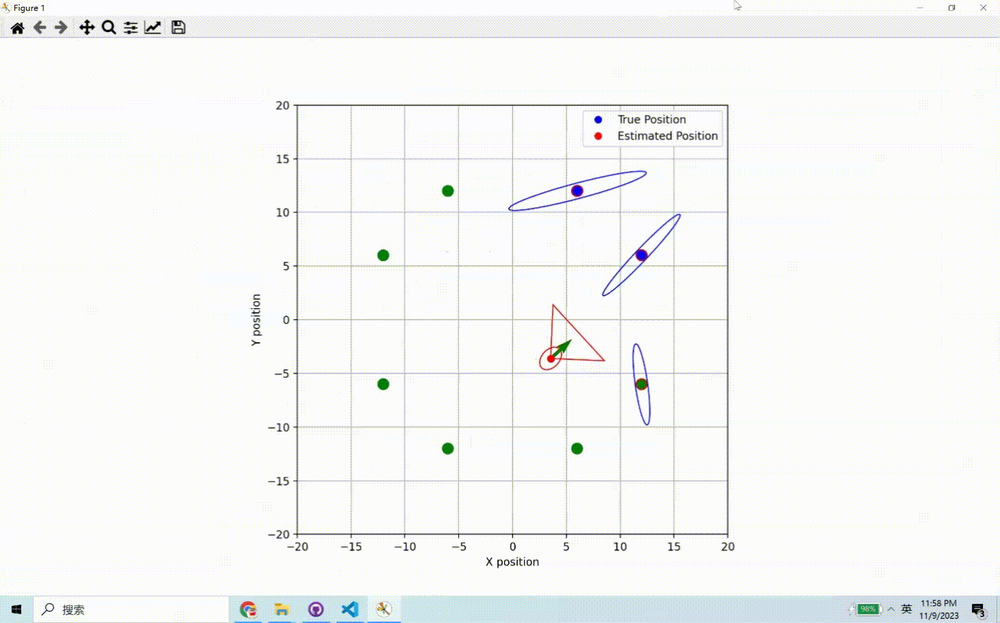

# Omni_EKF_SLAM
This approach uses an Extended Kalman Filter SLAM (Simultaneous Localization and Mapping) that adapts to omnidirectional movement. As the robot identifies new landmarks, it updates its state and covariance matrix to reflect these changes. 

To implement this algorithm in a real robot, you need to modify a couple of things: first, substitute the generic 'move' function with the specific control functions of your robot. Next, switch out the 'observe' function for one that actually observes and gathers data. This way, the algorithm can be effectively applied to a physical robot.

